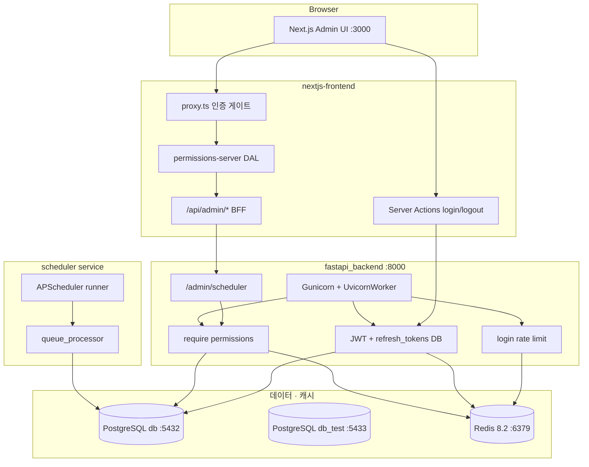

# 프로젝트 전체 구조 점검

> 점검일: 2026-09-02  
> 마지막 갱신: 2026-09-02  
> 대상: `nextjs-fastapi-template` (FastAPI 백엔드 + Next.js 관리자 프론트 + APScheduler 워커)

---

## 1. 아키텍처 개요



| 영역 | 경로 | 역할 |
|------|------|------|
| API | `fastapi_backend/app/` | async FastAPI, RBAC, JWT, refresh, Redis 연동 |
| 스케줄러 | `fastapi_backend/scheduler/` | sync APScheduler + 큐 처리 |
| 프론트 | `nextjs-frontend/` | 관리자 UI, BFF, HttpOnly 쿠키 |
| 인프라 | `docker-compose.yml`, `Makefile` | backend, frontend, redis, db, db_test, scheduler |

### Compose 서비스

| 서비스 | 이미지 / 빌드 | 포트 | 비고 |
|--------|---------------|------|------|
| `backend` | `fastapi_backend` | 8000 | Gunicorn, `env_file`, `depends_on` db/redis healthy |
| `frontend` | `nextjs-frontend` | 3000 | `depends_on` backend started |
| `scheduler` | `fastapi_backend` | — | `scheduler.runner`, backend와 동일 `env_file`, Redis 미사용 |
| `redis` | `redis:8.2-alpine` | 6379 | AOF, healthcheck |
| `db` | `postgres:18.6-trixie` | 5432 | healthcheck |
| `db_test` | `postgres:18.6-trixie` | 5433 | pytest 전용, **볼륨 없음** (ephemeral; `make docker-up-test-db`가 force-recreate) |

---

## 2. 기능별 점검

### 2.1 비동기 태스크 스케줄링

**구현 상태: 양호 (템플릿 수준)**

| 구성 | 설명 |
|------|------|
| `scheduler_jobs` | Cron 메타 (시간대, enabled) |
| `scheduler_job_queue` | 관리자 즉시 실행·재시작 요청 큐 |
| `scheduler_job_log` | 실행 이력 |
| `scheduler/runner.py` | 기동 시 Cron 등록 + 15초마다 큐 폴링 |
| `scheduler/queue_processor.py` | `FOR UPDATE SKIP LOCKED`, job_key 단위 동시 실행 제한 |
| `scheduler/jobs/registry.py` | job key 단일 소스 — `_JOB_RUNNERS`, `REGISTERED_JOB_KEYS` |
| `scheduler/jobs/_job_base.py` | advisory lock + 로그 기록 |

**잔여 이슈**

| 심각도 | 이슈 |
|--------|------|
| 중 | Cron 변경 후 **runner 재시작** 필요 (런타임에 DB 변경 미반영) |
| 낮 | 실제 job은 `sample_heartbeat` 하나뿐 |
| 낮 | 스케줄러 lock은 PostgreSQL advisory (`scheduler/lock.py`) — Redis 미연동 |

관련 문서: [`docs/scheduler.md`](scheduler.md)

---

### 2.2 회원 · 인증 · 권한

**구현 상태: RBAC 시드 대기**

| 기능 | 상태 |
|------|------|
| JWT access (1h) + `jti` | `DenyListJWTStrategy` |
| refresh (1d) + DB 해시·회전 | `auth_refresh.py`, `refresh_tokens` PG SSOT |
| access denylist (logout) | Redis `access_deny:{jti}` |
| 로그인 rate limit | `LOGIN_RATE_LIMIT_*` + Redis (multi-worker) |
| RBAC 8 permissions | `app/rbac/`, Redis 캐시 + PG SSOT (빈 권한 sentinel) |
| `/users/me` roles/permissions | `get_current_user` read-through cache |
| 회원가입 API | 미노출 (`/auth/register` 없음) |
| `is_superuser` | lifespan 개수 감시 |

**DB 스키마** — Alembic head `f2d7e14dd4af` (메인 `db` 적용)

`permissions`, `roles`, `role_permissions`, `user_roles`, `refresh_tokens`, `audit_logs`, `api_keys`

**캐시 무효화**

| 이벤트 | 동작 |
|--------|------|
| `assign_role` / `revoke_role` (`rbac/service.py`) | `invalidate_user_rbac` |
| `grant-role` CLI | `assign_role` 경유 |
| `seed-rbac` | `invalidate_all_rbac` |

**잔여 이슈**

| 심각도 | 이슈 |
|--------|------|
| **높음** | **RBAC 시드 미실행** — `roles`·`permissions` 0건 |
| 중 | `db_test` Alembic 미적용 (pytest `create_all` 사용) |
| 중 | `/users` 라우트 superuser 기준 (`user:manage` 등 미적용) |
| 중 | `audit_logs`, `api_keys` — 테이블만 존재, 라우트 없음 |

**배포 전 필수**

```bash
docker compose run --rm backend python -m app.cli seed-rbac
docker compose run --rm backend python -m app.cli grant-role --email <email> --role admin
```

---

### 2.3 Redis · Gunicorn

| 구성 | 설명 |
|------|------|
| `redis:8.2-alpine` | AOF, `redis_data` 볼륨, healthcheck |
| `app/redis.py` | async 클라이언트, lifespan 종료 |
| `app/services/login_rate_limit.py` | Redis / in-memory fallback |
| `gunicorn.conf.py` | `GUNICORN_WORKERS` env, `UvicornWorker` |

**Redis 3계층 (인증)**

| 용도 | Key 패턴 | SSOT / fallback |
|------|----------|-----------------|
| 로그인 rate limit | (login_rate 모듈) | Redis 필수 시 in-memory (테스트) |
| RBAC permissions | `user_perms:{uuid}`, `user_roles:{uuid}` | PG, Redis miss → PG; 빈 권한도 sentinel 캐시 |
| access denylist | `access_deny:{jti}` | logout 시 SET, Redis down → fail-open |

**환경변수**

| 변수 | 기본 | 설명 |
|------|------|------|
| `REDIS_URL` | compose: `redis://redis:6379/0` | 미설정 → in-memory |
| `PERMISSION_CACHE_TTL_SECONDS` | `300` | RBAC SET TTL |
| `GUNICORN_WORKERS` | `1` | 2+ 시 Redis 필수 |
| `LOGIN_RATE_LIMIT_*` | 300s / 5회 / 60s | 아이디별 잠금 |

**Prod Redis:** AUTH는 URL에 포함 (`redis://:pass@host:6379/0`), TLS는 `rediss://` — dev compose는 무AUTH.

```
최대 DB 연결 ≈ GUNICORN_WORKERS × (DB_POOL_SIZE + DB_MAX_OVERFLOW)
```

**잔여 · 선택**

| 항목 | 비고 |
|------|------|
| reuse 시 access jti 일괄 deny | session generation 미도입 |
| scheduler 분산 lock | replica 2+ 시 |
| backend `/health` 전용 엔드포인트 | 선택 |

---

### 2.4 프론트엔드 (BFF · 권한)

| BFF 경로 | 권한 |
|----------|------|
| `GET /api/admin/scheduler/jobs` | `scheduler:read` |
| `GET /api/admin/scheduler/job-keys` | `scheduler:read` |
| `POST/PATCH/DELETE .../jobs` | `scheduler:manage` |
| `GET /api/admin/scheduler/queue` | `scheduler:read` |
| `POST .../queue/.../cancel` | `scheduler:manage` |

인증: `proxy.ts` → `(protected)/layout` `requireServerUserMe()` → BFF `assertServerPermission()`

---

## 3. Python · FastAPI 컨벤션

**현재 준수:** DI, async/sync 분리, Pydantic v2, `AppError` + 전역 handler, Gunicorn 운영, pytest + `db_test`

**잔여**

| 심각도 | 이슈 |
|--------|------|
| 낮 | Redis AUTH·TLS — prod 가이드만 (dev compose 무AUTH) |
| 낮 | `gunicorn.conf.py` 미사용 `import multiprocessing` |

---

## 4. 보안 — 미조치

| # | 심각도 | 이슈 | 상세 |
|---|--------|------|------|
| S1 | 높음 | RBAC 시드 미실행 | `seed-rbac` + `grant-role` |
| S7 | 중 | backend `:8000` 호스트 노출 | BFF 우회 가능 |
| S9 | 중 | OpenAPI `/docs` 공개 | `OPENAPI_URL=""` 권장 |
| S10 | 중 | Redis `:6379` 호스트 노출 | prod 내부망만 권장 |

**조치됨 (2026-09-03):** compose DB 시크릿 → 루트 `.env` / `make init`; login rate limit INCR+LRU; logout `delete_cookie`; CORS example → `localhost:3000`.

---

## 5. 테스트 · 운영

| 항목 | 상태 |
|------|------|
| `make test-backend` | 49 passed, 8 skipped |
| Redis path 테스트 | permission_cache, access_denylist, rate limit concurrent |
| `db_test` Alembic | 미적용 |

**skip:** `test_main.py` (register 미노출), `test_email.py` (fastapi-mail API)

---

## 6. 액션 플랜

| 순위 | 작업 | 영역 |
|------|------|------|
| 1 | **RBAC 시드 + `grant-role`** | 백엔드 |
| 2 | 포트 노출 최소화 (db, redis, backend) | 인프라 |
| 3 | 프로덕션 OpenAPI 비활성화 · `REQUIRE_REDIS=true` | 보안 |
| 4 | (선택) `db_test` Alembic 적용 | 인프라 |

---

## 7. 종합 평가

| 축 | 평가 | 잔여 |
|----|------|------|
| 구조 · 모듈 분리 | 양호 | — |
| FastAPI · Redis · Gunicorn | 양호 | prod AUTH/TLS |
| 인증 · RBAC | 양호 | **시드** |
| Next.js · BFF · DAL | 양호 | — |
| DB · Alembic | 양호 | `db_test` (선택) |
| 테스트 | 양호 | — |
| 운영 · 보안 | **주의** | S1·S7·S9·S10 |

**한 줄 요약:** Redis 인증 3계층(rate limit, RBAC 캐시, access denylist)·compose healthcheck·시크릿 변수화가 반영되었다. 운영 투입 전 **`seed-rbac` + `grant-role`**, **포트·OpenAPI**, **노출된 DB 비밀번호 교체**가 필요하다.
