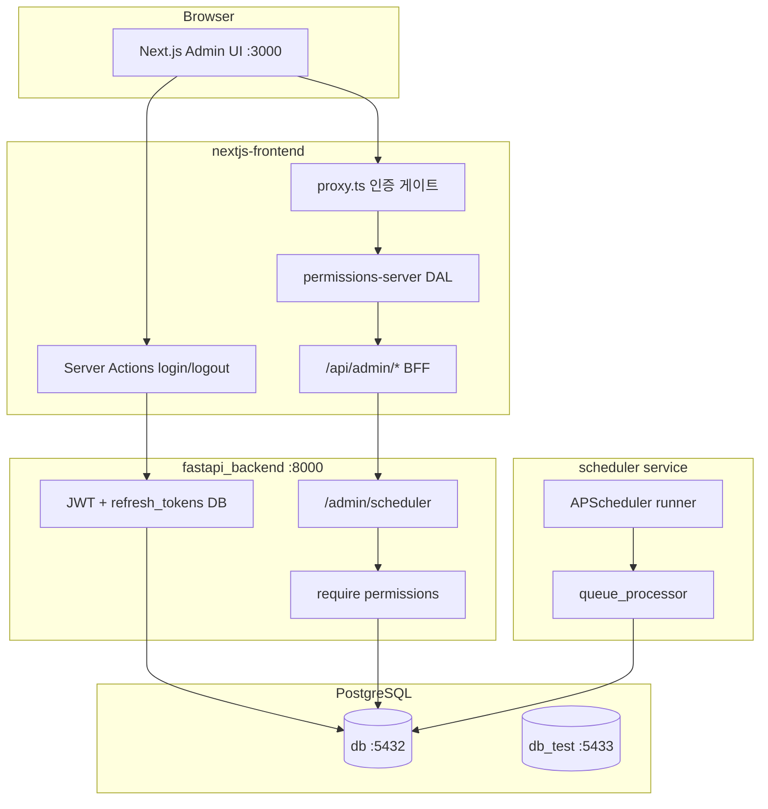

# 프로젝트 전체 구조 점검

> 점검일: 2026-09-02  
> 마지막 갱신: 2026-09-02 (보안·컨벤션: AppError, rate limit, refresh Set-Cookie, 비밀번호 규칙)  
> 대상: `nextjs-fastapi-template` (FastAPI 백엔드 + Next.js 관리자 프론트 + APScheduler 워커)

---

## 1. 아키텍처 개요



| 영역 | 경로 | 역할 |
|------|------|------|
| API | `fastapi_backend/app/` | async FastAPI, RBAC, JWT, refresh |
| 스케줄러 | `fastapi_backend/scheduler/` | sync APScheduler + 큐 처리 |
| 프론트 | `nextjs-frontend/` | 관리자 UI, BFF, HttpOnly 쿠키 |
| 인프라 | `docker-compose.yml`, `Makefile` | backend, frontend, db, db_test, scheduler |

---

## 2. 기능별 점검

### 2.1 비동기 태스크 스케줄링

**구현 상태: 양호 (템플릿 수준)**

| 구성 | 설명 |
|------|------|
| `scheduler_jobs` | Cron 메타 (시간대, enabled) |
| `scheduler_job_queue` | 관리자 즉시 실행·재시작 요청 큐 |
| `scheduler_job_log` | 실행 이력 |
| `scheduler/runner.py` | 기동 시 Cron 등록 + 15초마다 큐 폴링 |
| `scheduler/queue_processor.py` | `FOR UPDATE SKIP LOCKED`, job_key 단위 동시 실행 제한 |
| `scheduler/jobs/_job_base.py` | advisory lock + 로그 기록 |

**주의사항**

| 심각도 | 이슈 |
|--------|------|
| 중 | Cron 변경 후 **runner 재시작** 필요 (런타임에 DB 변경 미반영) |
| ~~중~~ | ~~`REGISTERED_JOB_KEYS` vs `KNOWN_JOB_KEYS` 중복~~ — **해결** `scheduler/jobs/registry.py` 단일 소스 + `GET /job-keys` |
| 낮 | 실제 job은 `sample_heartbeat` 하나뿐 |

관련 문서: [`docs/scheduler.md`](scheduler.md)

---

### 2.2 회원 · 인증 · 권한

**구현 상태: 마이그레이션 완료, RBAC 시드 대기**

| 기능 | 상태 |
|------|------|
| JWT access (1h) | fastapi-users `JWTStrategy` |
| refresh (1d) + DB 해시·회전 | `app/routes/auth_refresh.py`, `refresh_tokens` 테이블 ✅ |
| RBAC 8 permissions | `app/rbac/`, `require()` — **테이블 생성됨, 시드 미실행** |
| `/users/me` roles/permissions | `app/routes/users_me.py` |
| 회원가입 API | **미노출** (`/auth/register` 라우터 없음) |
| `is_superuser` | 유지 + lifespan 개수 감시 |

#### Alembic 마이그레이션 (2026-09-02 확인)

| 항목 | 결과 |
|------|------|
| 현재 head | `f2d7e14dd4af` |
| 마이그레이션 파일 | [`f2d7e14dd4af_add_refresh_tokens_table.py`](../fastapi_backend/alembic_migrations/versions/f2d7e14dd4af_add_refresh_tokens_table.py) |
| 적용 DB | 메인 `db` (`alembic current` → head 확인) |
| 리비전 체인 | `f532d17c937f` → `87ab01be428b` → `f6e1569cffd6` → **`f2d7e14dd4af`** |

**생성된 테이블 (7개)**

| 테이블 | 모델 | 확인 |
|--------|------|------|
| `permissions` | `Permission` | ✅ |
| `roles` | `Role` | ✅ |
| `role_permissions` | `RolePermission` | ✅ |
| `user_roles` | `UserRole` | ✅ |
| `refresh_tokens` | `RefreshToken` | ✅ (partial index `revoked_at IS NULL`) |
| `audit_logs` | `AuditLog` | ✅ |
| `api_keys` | `ApiKey` | ✅ |

**갭**

| 심각도 | 이슈 |
|--------|------|
| **높음** | **RBAC 시드 미실행** — `roles`·`permissions` 0건. 아래 CLI 실행 필요 |
| 중 | `db_test`에 Alembic 미적용 (테스트는 `conftest` `create_all`로 스키마 생성) |
| 중 | `user:manage`, `role:manage` 등 권한 정의됐으나 `/users` 라우트는 **superuser 기준** |
| 중 | `audit_logs`, `api_keys` 테이블만 존재, 라우트·호출 없음 |
| 낮 | 비밀번호 검증 | **8자+ 영문·숫자·특수문자 3종** — `services/password_validation.py` ✅ |

**배포 전 필수 (시드·역할 부여)**

```bash
# 마이그레이션 — 완료됨 (재실행 불필요)
# docker compose run --rm backend alembic upgrade head

# RBAC 시드 + 관리자 역할 부여 — 아직 필요
docker compose run --rm backend python -m app.cli seed-rbac
docker compose run --rm backend python -m app.cli grant-role --email <email> --role admin
```

관련 문서:

- [`nextjs-frontend/docs/admin-web-auth-design.md`](../nextjs-frontend/docs/admin-web-auth-design.md)
- [`nextjs-frontend/docs/REFRESH_TOKEN_FLOW.md`](../nextjs-frontend/docs/REFRESH_TOKEN_FLOW.md)
- [`fastapi_backend/docs/JWT_AUTH_REVIEW.md`](../fastapi_backend/docs/JWT_AUTH_REVIEW.md)

---

### 2.3 프론트엔드 (BFF · 권한)

| 패턴 | 평가 |
|------|------|
| HttpOnly `accessToken` / `refreshToken` | 적절 |
| BFF `lib/admin-api-proxy.ts` + `assertServerPermission` | 적절 |
| DAL `lib/permissions-server.ts` + `lib/auth-cookies.ts` | 적절 |
| 백엔드 RBAC가 SSOT | 스케줄러 API 확인됨 |
| Nav / Forbidden | UX용 — 백엔드와 병행 필요 |

BFF 권한 매핑 예:

| BFF 경로 | 권한 |
|----------|------|
| `GET /api/admin/scheduler/jobs` | `scheduler:read` |
| `POST/PATCH/DELETE .../jobs` | `scheduler:manage` |
| `GET /api/admin/scheduler/queue` | `scheduler:read` |
| `POST .../queue/.../cancel` | `scheduler:manage` |

---

## 3. Next.js Proxy (구 middleware) — 정정 사항

### 3.1 Next.js 16: Middleware → Proxy 이름 변경

Next.js 16부터 `middleware.ts` 파일 컨벤션이 **`proxy.ts`로 변경**되었습니다.

- 공식 안내: [Renaming Middleware to Proxy](https://nextjs.org/docs/messages/middleware-to-proxy)
- 이유: Express.js middleware와 혼동 방지, 역할(앱 앞단 네트워크 경계)을 명확히 하기 위함
- 마이그레이션: `export function middleware` → `export function proxy`

```diff
// middleware.ts → proxy.ts
- export function middleware(request: NextRequest) {
+ export function proxy(request: NextRequest) {
```

### 3.2 본 프로젝트 현황

| 항목 | 상태 |
|------|------|
| Next.js 버전 | **16.3.3** (`nextjs-frontend/package.json`) |
| 파일 | [`nextjs-frontend/proxy.ts`](../nextjs-frontend/proxy.ts) **존재** |
| 함수명 | `export async function proxy` — **컨벤션 준수** |
| `middleware.ts` | 없음 — **의도된 상태** (deprecated 컨벤션 미사용) |

**결론:** 초기 점검에서 「`middleware.ts` 미연결」로 기술했으나, **Next.js 16에서는 `proxy.ts`가 정식 파일**이므로 해당 지적은 **오류**입니다. 별도 `middleware.ts` 생성은 불필요하며, 오히려 [공식 마이그레이션 방향](https://nextjs.org/docs/messages/middleware-to-proxy)과 반대입니다.

### 3.3 `proxy.ts` 동작 요약

```typescript
// nextjs-frontend/proxy.ts (요약)
// - accessToken·refreshToken 둘 다 없고 public 경로가 아니면 → /login 리다이렉트
// - 토큰 있고 public 경로(/login 등)면 → / 리다이렉트
// - matcher: /api, _next/static 등 제외
```

| matcher 제외 | 의미 |
|--------------|------|
| `api` | BFF는 **라우트 핸들러별** `assertServerPermission`으로 인증 |
| `_next/static`, `favicon.ico` 등 | 정적 리소스 |

### 3.4 프론트 인증 이슈 (조치 완료)

[Next.js Authentication 가이드](https://nextjs.org/docs/app/guides/authentication)의 DAL 패턴과 BFF Route Handler 인증 가이드에 맞춰 아래 이슈를 조치했습니다.

| 이슈 | 조치 |
|------|------|
| Protected layout 미리다이렉트 없음 | [`requireServerUserMe()`](../nextjs-frontend/lib/permissions-server.ts) — 세션 복구 실패 시 쿠키 삭제 후 `/login` |
| `/api/users/me` refresh 미연동 | [`getAuthenticatedSession()`](../nextjs-frontend/lib/permissions-server.ts) — access 만료 시 refresh 후 `/users/me` 재시도 |
| refresh 로직 중복 | [`lib/auth-cookies.ts`](../nextjs-frontend/lib/auth-cookies.ts)로 통합 (`permissions-server`, `clientConfig` 공유) |

**인증 3단계 (defense in depth)**

| 단계 | 위치 | 역할 |
|------|------|------|
| 1차 | `proxy.ts` | 쿠키 존재 여부 (public 경로 게이트) |
| 2차 | `(protected)/layout.tsx` | `requireServerUserMe()` — 세션 검증 + refresh |
| 3차 | BFF Route Handlers | `assertServerPermission()` — 권한 검사 |

**남은 문서 작업:** 없음 — [`authorization-guide.md`](../nextjs-frontend/docs/authorization-guide.md), [`admin-web-auth-design.md`](../nextjs-frontend/docs/admin-web-auth-design.md) `proxy.ts` 예제 갱신 완료 ✅

---

## 4. Python · FastAPI 컨벤션

### 4.1 잘 된 점

- **DI**: `Depends(get_async_session)`, `Depends(require(...))` 일관적
- **async API / sync worker 분리**: API `asyncpg`, 스케줄러 `psycopg2`
- **Pydantic v2**: `UserUpdate`에 `extra="forbid"`, `is_superuser` 제거
- **라우트 권한 정적 검사**: `tests/routes/test_route_permissions.py`
- **SQL**: ORM·parameterized `text()` — SQL injection 위험 낮음
- **설정**: `pydantic-settings` env 분리
- **테스트**: pytest 9.1 + pytest-asyncio 1.4, `db_test` compose 서비스

### 4.2 개선 권장

| 심각도 | 이슈 | 위치 |
|--------|------|------|
| ~~중~~ | ~~`print()` 대신 `logging`~~ | `app/users.py` ✅ |
| ~~중~~ | ~~service에서 `HTTPException` 직접 raise~~ | `RefreshTokenError` + 전역 handler ✅ |
| ~~낮~~ | ~~페이지네이션 수동 `page`/`size`~~ | `Params = Depends()` 통일 ✅ |
| ~~낮~~ | ~~전역 exception handler 없음~~ | `app/exception_handlers.py` ✅ |
| ~~낮~~ | ~~refresh JWT `iat` 초 단위 해시 충돌~~ | `jti: uuid7()` 추가 ✅ |
| ~~중~~ | ~~service 계층 일반화~~ | `AppError` 계열 + service/route 분리 ✅ |
| ~~중~~ | ~~admin route의 `HTTPException`~~ | `AppError` / `NotFoundError` / `ConflictError` ✅ |

---

## 5. 보안 검토

### 5.1 높음 (우선 조치)

| # | 이슈 | 상세 |
|---|------|------|
| ~~S1~~ | ~~Alembic 마이그레이션 누락~~ | **해결** — 메인 `db` head `f2d7e14dd4af` 적용 완료. **RBAC 시드·`grant-role`은 미실행** |
| S1b | **RBAC 시드 미실행** | `roles`·`permissions` 0건 — `seed-rbac` + `grant-role` 필요 |
| S2 | **compose DB 비밀번호 평문** | [`docker-compose.yml`](../docker-compose.yml) `environment` |
| ~~S3~~ | ~~인증 토큰 로그 출력~~ | **해결** — `on_after_request_verify`·`on_after_register`를 `logger.info`로 변경 ([`app/users.py`](../fastapi_backend/app/users.py)) |

> `.env`는 루트 [`.gitignore`](../.gitignore)에 포함되어 git 추적 제외 대상입니다. `fastapi_backend/.gitignore`는 `.vercel`만 있으나, 루트 규칙이 적용됩니다.

### 5.2 중간

| # | 이슈 | 상세 |
|---|------|------|
| S4 | CORS `*` + `allow_credentials=True` | [`.env.example`](../fastapi_backend/.env.example) — 프로덕션 부적합 |
| ~~S5~~ | ~~refresh token JSON body 반환~~ | **해결** — `Set-Cookie`만 사용, JSON body에서 `refresh_token` 제거 |
| ~~S6~~ | ~~`UserUpdate.is_active` 노출~~ | **해결** — `UserUpdate`에서 `is_active` 필드 제거 |
| S7 | backend `:8000` 호스트 포트 노출 | BFF 우회 직접 API 호출 가능 (백엔드 RBAC는 적용) |
| ~~S8~~ | ~~로그인 rate limit 없음~~ | **해결** — `LOGIN_RATE_LIMIT_*` + **Redis** (`REDIS_URL`, multi-worker) |
| S9 | OpenAPI `/docs` 공개 | 프로덕션 `OPENAPI_URL=""` 권장 |

### 5.3 낮음 · 양호

코드·테스트 기준 **확인 완료** (2026-09-02).

| 항목 | 검증 | 근거 |
|------|------|------|
| HttpOnly 쿠키, Bearer 서버 주입 | ✓ | `login-action.ts`, `auth-cookies.ts` — `httpOnly: true`; Bearer는 server action·BFF·`permissions-server.ts`만 사용. 클라이언트 UI는 `/api/admin/*` BFF만 호출 |
| refresh rotation + reuse → 세션 전체 폐기 | ✓ | `refresh_tokens.py` `verify_refresh_token_row` → `revoke_all_user_refresh_tokens`; `test_refresh_token_reuse_revokes_sessions` |
| `is_superuser` / `is_active` API 업데이트 차단 | ✓ | `UserUpdate` (`extra=forbid`, `email`·`password`만); `test_user_update_rejects_privileged_fields` |
| BFF 경로 하드코딩 (open proxy 아님) | ✓ | `app/api/admin/scheduler/**/route.ts` — 고정 `backendPath`; `admin-api-proxy.ts` `/admin/scheduler` allowlist |
| SQL injection | ✓ | SQLAlchemy ORM·파라미터 바인딩; raw SQL 없음 |
| Next.js 16 `proxy.ts` | ✓ | `proxy.ts` — `export async function proxy`, matcher에서 `api` 제외 ([문서](https://nextjs.org/docs/messages/middleware-to-proxy)) |
| 프론트 DAL 일원화 | ✓ | `auth-cookies.ts` + `permissions-server.ts` — refresh·`/users/me`·권한 검증 |

**보강 (이번 점검)**

- `admin-api-proxy.ts`: `/admin/scheduler` prefix allowlist (방어적 계층)
- `COOKIE_SECURE` env: 백엔드 refresh `Set-Cookie` Secure 플래그 (프론트 `NODE_ENV=production`과 대칭)

---

## 6. 테스트 · 운영 준비도

| 항목 | 상태 |
|------|------|
| `make test-backend` (로컬) | **34 passed**, 8 skipped |
| `tests/routes/test_auth_rbac.py` | **10 passed** — refresh Set-Cookie, RBAC, UserUpdate 거부 |
| `tests/routes/test_auth_login_rate_limit.py` | **2 passed** — 5회 실패 잠금 |
| `tests/services/test_password_validation.py` | **5 passed** |
| `make docker-test-backend` | `db_test:5432` — **이미지 재빌드 후** 25 passed 예상 (볼륨 미마운트 시 소스 미반영) |
| 테스트 DB | `make docker-up-test-db` → `db_test` (호스트 `:5433`, 컨테이너 내부 `:5432`) |
| `db_test` Alembic | **미적용** — pytest는 `conftest` `create_all` 사용 |
| 메인 `db` Alembic | **head** `f2d7e14dd4af` 적용 완료 |
| pytest | 9.1.1 + pytest-asyncio 1.4.0 |
| refresh/RBAC 라이프사이클 테스트 | **추가됨** (`test_auth_rbac.py`) |
| 스케줄러 admin CRUD 테스트 | list, enqueue만 |
| email / register 테스트 | skip 처리 |

**skip 사유**

| 테스트 | 사유 |
|--------|------|
| `tests/main/test_main.py` | 회원가입 API 미노출 (`/auth/register` 없음) |
| `tests/test_email.py` | fastapi-mail API 변경 |

---

## 7. 우선순위 액션 플랜

| 순위 | 작업 | 영역 |
|------|------|------|
| 1 | ~~Alembic 마이그레이션 생성·적용~~ | 백엔드 ✅ |
| 1b | **RBAC 시드 + `grant-role`** (`seed-rbac`, admin 역할 부여) | 백엔드 |
| ~~2~~ | ~~verification token `print` 제거~~ | 보안 ✅ |
| 3 | compose 시크릿 env 분리 / 포트 노출 최소화 | 인프라 |
| 4 | 프로덕션 CORS·OpenAPI 비활성화 | 보안 |
| ~~4b~~ | ~~refresh JSON body / is_active / rate limit / 비밀번호 규칙~~ | 보안 ✅ |
| 5 | ~~protected layout 인증 실패 시 리다이렉트~~ | 프론트 ✅ |
| ~~6~~ | ~~refresh/auth/RBAC 통합 테스트 추가~~ | 품질 ✅ |
| ~~7~~ | ~~설계 문서 `middleware.ts` → `proxy.ts` 예제 갱신~~ | 문서 ✅ |
| ~~8~~ | ~~job key 상수 단일화~~ | 스케줄러 ✅ |
| 9 | (선택) `db_test`에 `alembic upgrade head` 적용 — 운영 DB와 스키마 일치 | 인프라 |

---

## 8. 종합 평가

| 축 | 평가 | 요약 |
|----|------|------|
| 구조 · 모듈 분리 | **양호** | API / scheduler / BFF 역할 분리 명확 |
| FastAPI 컨벤션 | **양호** | DI, async, Pydantic 대체로 준수 |
| 인증 · RBAC 설계 | **양호** | refresh DB 테이블 생성 완료, `require()`, BFF 패턴 적절 — **시드만 남음** |
| Next.js Proxy | **양호** | Next 16 `proxy.ts` 컨벤션 준수 ([공식 문서](https://nextjs.org/docs/messages/middleware-to-proxy)) |
| 프론트 인증 (DAL) | **양호** | `requireServerUserMe`, `getAuthenticatedSession`, `auth-cookies` 통합 |
| DB 스키마 (Alembic) | **양호** | 메인 `db` head `f2d7e14dd4af` — RBAC·refresh·audit·api_keys 테이블 확인 |
| 테스트 커버리지 | **양호** | refresh/RBAC 통합 테스트 9건 추가 |
| 운영 준비 | **주의** | RBAC 시드·시크릿 관리 미완 |
| 보안 | **주의** | compose 시크릿(S2) 조치 필요 — S3(토큰 로그) 해결 |

**한 줄 요약:** Alembic·Proxy·DAL·통합 테스트까지 갖춰졌으며, 운영 투입 전 **`seed-rbac` + `grant-role`** 실행과 **compose 시크릿(S2)** 조치가 남아 있습니다.
